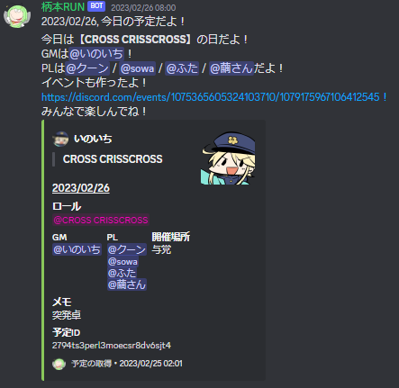
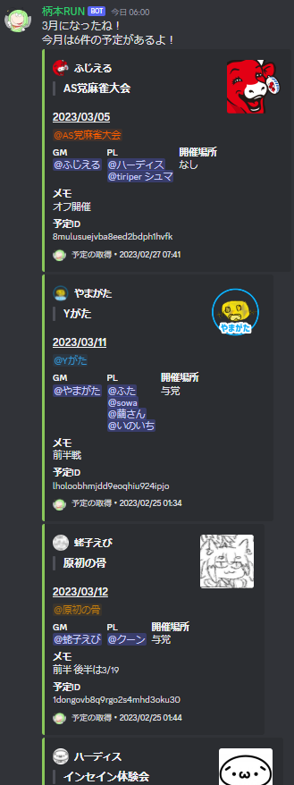

## どんなことができるの？

### 予定の管理

- Discord上で卓の予定を管理できます.
  - 卓の予定の閲覧,追加,更新,削除ができます.  
      
  - さらに予定の追加を行った時に,GMに対してGM権限を自動で付与してくれます.
    - さらにさらに,自動でその卓用のロールも作成し,GMとPLに付与します.  
       
  - 管理はGoogleカレンダーを使います.Googleカレンダーから閲覧したい人も安心.  
    

### 予定の通知

- 卓の日の朝6時になったら,Discord上で卓の予定を連絡してくれます.
  - さらに,卓用のイベントも自動で作成してくれます.  
    

- それ以外に,月次,週次の予定の連絡もしてくれます.
  - 毎月1日の朝6時になると,その月の予定を連絡してくれます.  
    

  - 毎週月曜日の朝6時になると,その週の予定を連絡してくれます.  
    
