## 目次

- [まずは挨拶してみよう](#まずは挨拶してみよう)
  - [柄本RUNにあいさつする](#まずは挨拶してみよう)
- [基本的な使いかた](#基本的な使いかた)
  - [卓の予定を見てみよう](#卓の予定を見てみよう)
  - [卓の予定を追加しよう](#卓の予定を追加しよう)
  - [卓の日の朝になると](#卓の日の朝になると)
  - [卓の終了後に卓用ロールを削除しよう](#卓の終了後に卓用ロールを削除しよう)
- [予定の修正と削除のやりかた](#予定の修正と削除のやりかた)
  - [卓の予定を修正しよう](#卓の予定を修正しよう)
  - [卓の予定をコピーしよう](#卓の予定をコピーしよう)
  - [間違って作った卓予定を削除しよう](#間違って作った卓予定を削除しよう)
- [予定の通知タイミング](#予定の通知タイミング)
  - [毎月の予定通知](#毎月の予定通知)
  - [毎週の予定通知](#毎週の予定通知)
  - [毎日の予定通知](#毎日の予定通知)

## まずは挨拶してみよう

まずは触ってみて使い方を覚えましょう.

### 柄本RUNにあいさつする

- もっとも基本的なコマンドを使ってみましょう.  
  1. Discordのメッセージ欄に`/`を入力してください.botコマンド一覧が表示されます.  
    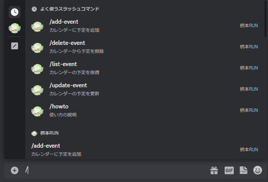  

  1. `/hello`を選択します.  
    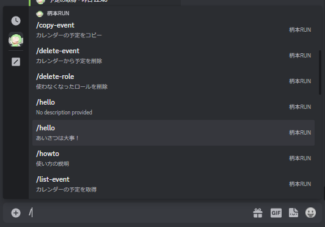  

  1. そのままメッセージを投稿します.  
    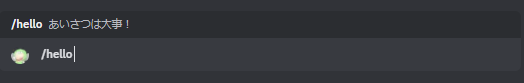  

  1. 柄本RUNがあなたにあいさつします.  
    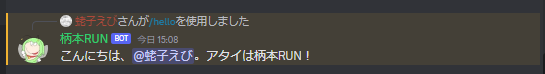  

## 基本的な使いかた

よくある使い方の説明です.

### 卓の予定を見てみよう

- 現在登録されている卓の予定を確認してみましょう.
  1. Discordのメッセージ欄に`/`を入力してください.botコマンド一覧が表示されます.  
      

  1. `/list-event`を選択します.  
    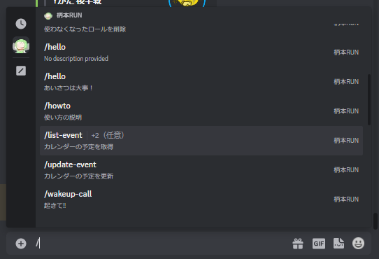  

  1. そのままメッセージを投稿します.  
    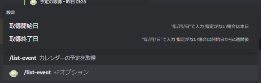  

  1. 今日から4週間分の卓予定を取得できます.  
    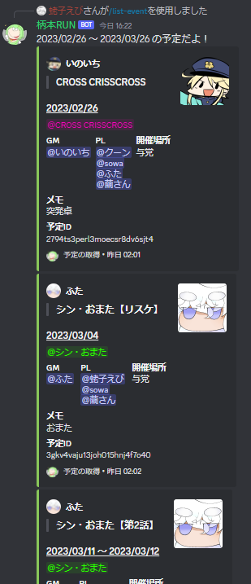  

  1. `取得開始日`と`取得終了日`を指定すると,その間の予定だけ取得できます.  
    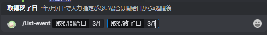  
    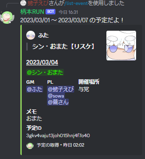  

### 卓の予定を追加しよう

- 卓の予定が決まったら,卓を追加してみましょう.
  1. Discordのメッセージ欄に`/`を入力してください.botコマンド一覧が表示されます.  
      

  1. `/add-event`を選択します.  
    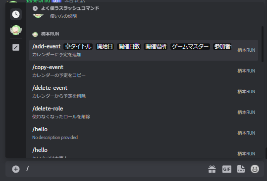  

  1. メッセージにコマンドが入力されます.  
    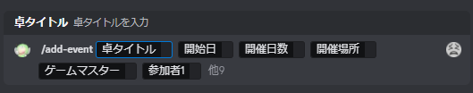  

  1. では,試しに以下の卓を作成してみましょう.

      ```yaml
      卓タイトル: エイプリルおまた卓  
      開催日: 2023/4/1  
      開催日数: 2日  
      開催場所: 与党  
      GM: ふた  
      PL: 蛯子えび/やまがた/繭さん/ハーディス  
      追記事項: もう1名募集中
      ```

  1. 説明が書いてある通りに項目を入力します.  
     まずは参加者1までを設定します.  
     GMやPLは,サーバーにいるメンバーリストから選択できます.
    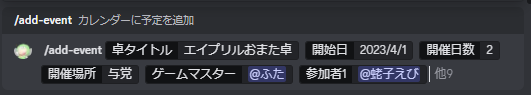  

  1. 参加者を追加する時は,設定項目のリストから選択します.  
    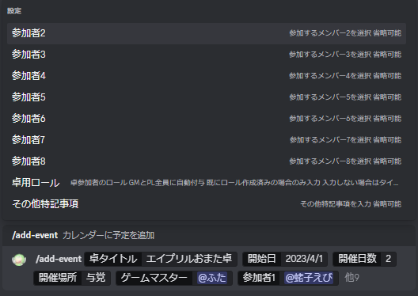  

  1. 設定項目を選択すると,設定できる項目が増えます.  
    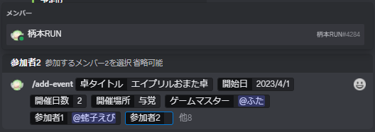  

  1. 同様に,必要な設定項目を選択して全て入力します.  
    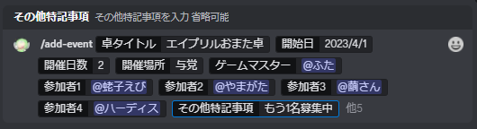  

  1. 入力が終わったら,メッセージを送信します.  

  1. 追加に成功すると,柄本RUNがメッセージを返します.  
     追加された予定が正しいかご確認ください.  
     また,GMに設定したメンバーには自動的にGM権限ロールが付与され,  
     GMと参加者に設定したメンバーには自動的に卓ロールが付与されます.  
     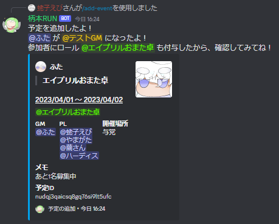  

### 卓の日の朝になると

- 卓予定の日になると,その日の朝6時に通知を投稿します.
  - さらに,開催場所を`なし`以外に設定していると,  
    その会場にイベントを作成します.  
    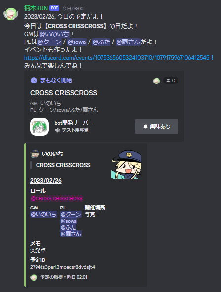  

### 卓の終了後に卓用ロールを削除しよう

- 卓が終わったら,卓で使ったロールを削除しましょう.
  1. Discordのメッセージ欄に`/`を入力してください.botコマンド一覧が表示されます.  
    

  1. `/delete-role`を選択します.  
    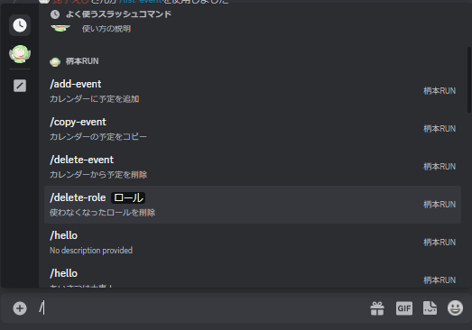  

  1. 削除するロールを指定して,メッセージを投稿します.  
    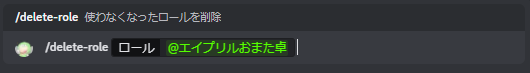  

  1. 卓用ロールを削除します.卓開催お疲れ様でした.  
    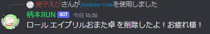  

## 予定の修正と削除のやりかた

主に卓の予定を修正したい時に使うコマンドです.

### 卓の予定を修正しよう

- 間違えて登録してしまったり,後で予定を修正したい場合は,更新コマンドを使いましょう.  
  1. まず,修正したい予定の予定IDを取得します.  
     [卓の予定を見てみよう](#卓の予定を見てみよう)を参考に,修正したい予定を取得してください.
     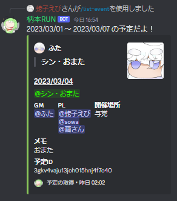  

  1. 卓予定に含まれる`予定ID`をコピーします.  
     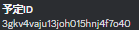  

  1. Discordのメッセージ欄に`/`を入力してください.botコマンド一覧が表示されます.  
       

  1. `/update-event`を選択します.  
     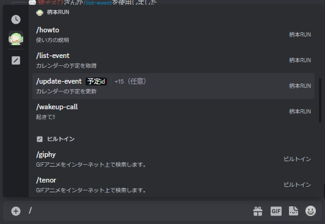  

  1. まずは,先ほどコピーした`予定ID`を入力します.  
     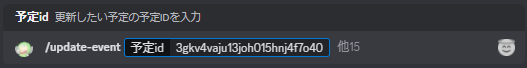  

  1. 例として,以下のように予定を修正してみましょう.  

      ```yaml
      卓タイトル: シン・おまた -> 超・おまた  
      開催日: 2023/4/1(修正なし)  
      開催日数: 1日(修正なし)  
      開催場所: 与党(修正なし)  
      GM: ふた(修正なし)  
      PL: 蛯子えび/sowa/繭さん -> 蛯子えび/sowa/繭さん/クーン   
      追記事項: おまた -> イインカイナ
      ```

  1. 上記に合わせて,必要な項目を入力します.  
     更新する項目のみを設定するようにしてください.  
     今回では,`卓タイトル`,`開催日数`,`参加者`,`追記事項`のみを設定します.
     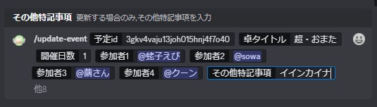  
     - **注意事項**
       - 参加者の更新を行う場合は,**変更後の参加者を全員追加してください.**  
         変更前の参加者は全員上書きされます.  
         今回の場合でいえば,`クーン`のみを指定するのではなく,  
         `蛯子えび`,`sowa`,`繭さん`,`クーン`全員を指定してください

  1. 入力が終わったら,メッセージを送信します.  

  1. 更新に成功すると,柄本RUNがメッセージを投稿します.  
     更新前と更新後の予定が表示されるので,ご確認ください.  
     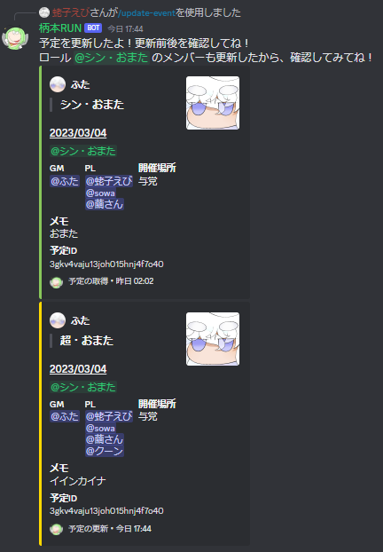  

  - 参考情報
    - 更新で参加者やロールが変わった場合,次のようにロールを操作します.
      - GM,参加者が変更された場合,更新前のメンバーから卓ロールを剥ぎ取り,  
        更新後の参加者に卓ロールを付与します.
      - GMが変更された場合,更新前のGMからGM権限を剥ぎ取り,  
        更新後のGMにGM権限を付与します.
      - 卓ロールが変更された場合,更新前の卓ロールを更新前のGMと参加者から剥ぎ取り,  
        更新後の卓ロールを更新後のGMと参加者に付与します.

### 卓の予定をコピーしよう

- キャンペーンや週跨ぎの開催など,同じ参加者とロールで違う日に予定を追加したい場合は,  
  コピーコマンドを使いましょう.
  1. まず,コピーしたい予定の予定IDを取得します.  
     [卓の予定を見てみよう](#卓の予定を見てみよう)を参考に,コピーしたい予定を取得してください.  
       

  1. Discordのメッセージ欄に`/`を入力してください.botコマンド一覧が表示されます.  
       

  1. `/copy-event`を選択します.  
     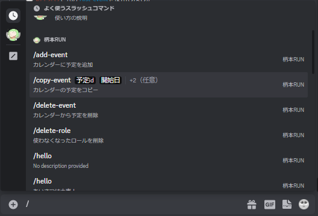  

  1. まずは,先ほどコピーした`予定ID`を入力します.  
     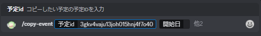  

  1. 例として,以下のように予定をコピーしてみましょう.

      ```yaml
      卓タイトル: シン・おまた 第2話  
      開催日: 2023/4/8  
      開催日数: 2日  
      ```

  1. 上記に合わせて,必要な項目を入力します.
     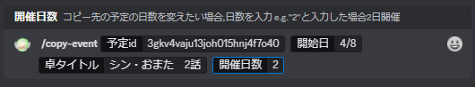  

  1. 入力が終わったら,メッセージを送信します.  

  1. コピーに成功すると,柄本RUNがメッセージを投稿します.  
     コピー元の予定とコピー先の予定が表示されるので,ご確認ください.  
     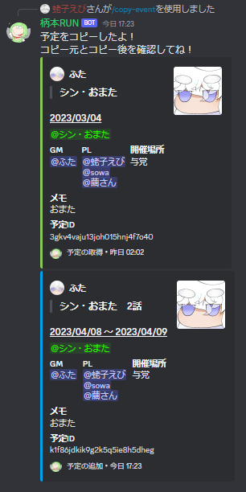  
     - この操作ではロールの更新は行いません.

### 間違って作った卓予定を削除しよう

- 卓予定を削除したい場合は,削除コマンドを使いましょう.
  1. まず,削除したい予定の予定IDを取得します.  
     [卓の予定を見てみよう](#卓の予定を見てみよう)を参考に,削除したい予定を取得してください.  
     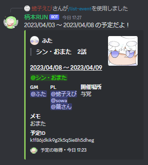  

  1. Discordのメッセージ欄に`/`を入力してください.botコマンド一覧が表示されます.
       

  1. `/delete-event`を選択します.
     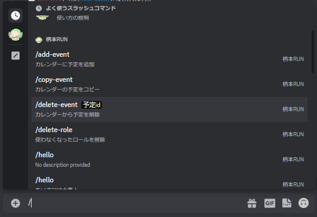  

  1. 先ほどコピーした`予定ID`を入力します.  
     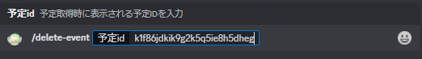  

  1. 入力が終わったら,メッセージを送信します.  

  1. 削除に成功すると,柄本RUNがメッセージを投稿します.  
     削除した予定が表示されるので,ご確認ください.
     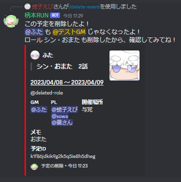  

  - **注意事項**
    - 予定を削除すると,GMからGM権限が剥がされ,卓用ロールが削除されます.  
      他の予定で同じロールを使用していると,まるごと削除されます.ご注意ください.

## 予定の通知タイミング

### 毎月の予定通知

- 毎月1日になると,朝6時にその月の予定を通知します.  
  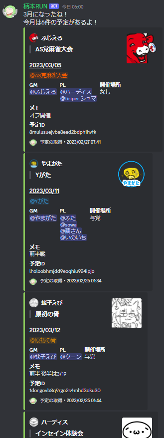  

### 毎週の予定通知

- 毎週月曜日になると,朝6時にその週の予定を通知します.  
  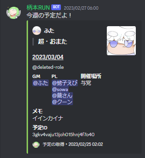  

### 毎日の予定通知

- 予定がある日は,朝6時にその日の予定を通知します.  
  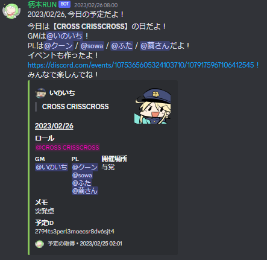  
